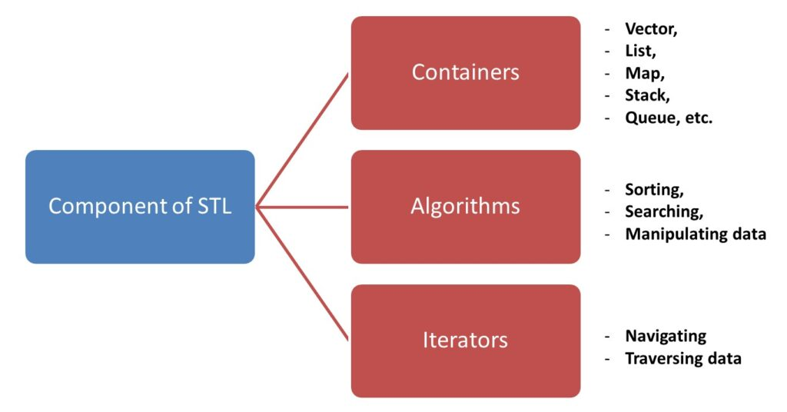
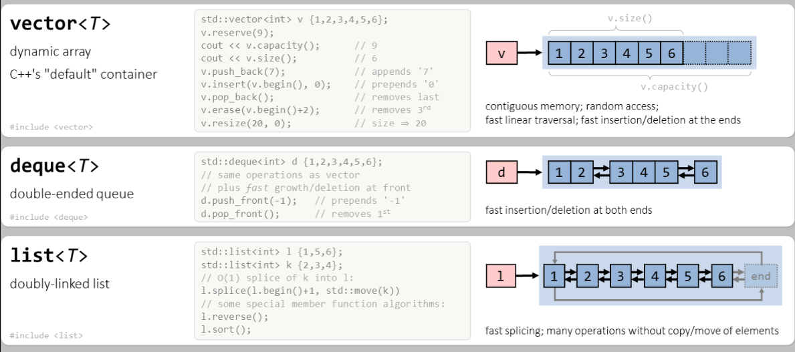
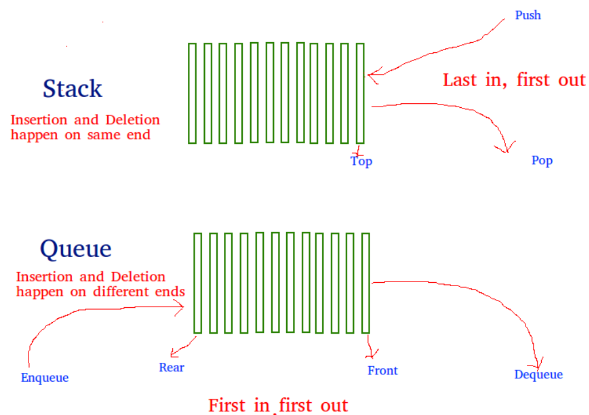
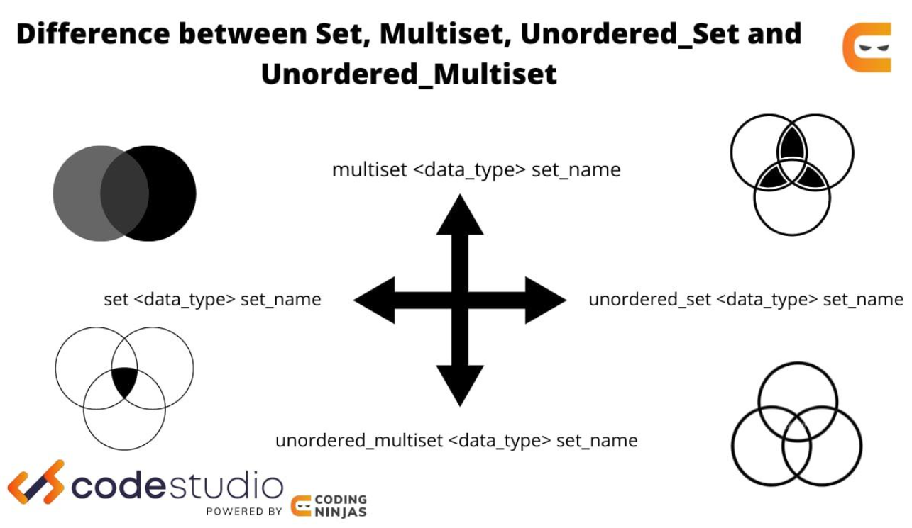
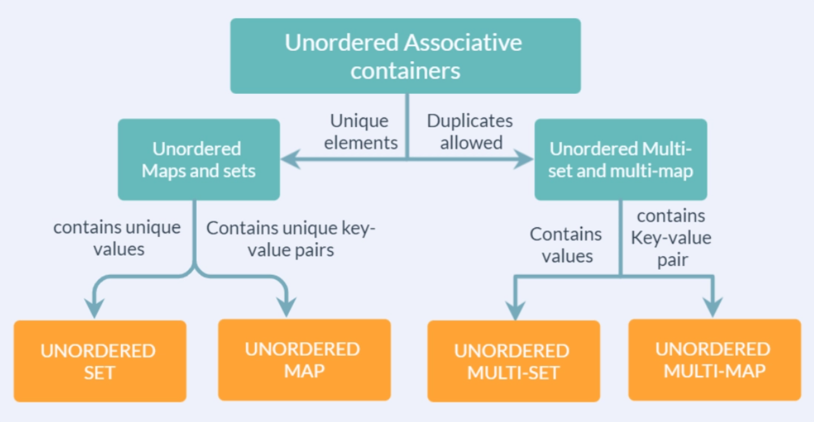

# README - explaining all the STL function works 🛠️



A complete guide to the 13 STL helpers and containers demonstrated in **stl.cpp**, with simple explanations, side-by-side differences, performance characteristics, and illustrative diagrams.

---

## Table of Contents 😊

1. [Pair](#1-pair-)  
2. [Vector](#2-vector-)  
3. [List](#3-list-)  
4. [Deque](#4-deque-)  
5. [Stack](#5-stack-)  
6. [Queue](#6-queue)  
7. [Priority Queue](#7-priority-queue-)  
8. [Set](#8-set-)  
9. [MultiSet](#9-multiset-)  
10. [Unordered Set](#10-unordered-set-)  
11. [Map](#11-map)  
12. [MultiMap](#12-multimap)  
13. [Unordered Map](#13-unordered-map)  
14. [Differences & Performance](#14-differences--performance)  
15. [Learn More & Links](#15-learn-more--links-)  

---

## 1. Pair 🔗

A tiny helper to hold **two** related values.

```cpp
#include <utility>
using namespace std;

pair<int,string> p = {1, "Hardik"};
cout << p.first << " - " << p.second;  // 1 - Hardik
```

- **Use case**: return two values, store key/value in a map, group small data  
- **Header**: `<utility>`

---

## 2. Vector 📦

A **dynamic array** that resizes automatically.

```cpp
#include <vector>
using namespace std;

vector<int> v = {10, 20, 30};
v.push_back(40);            // O(1) amortized
cout << v[2];               // O(1) random access
```

- **Fast** random access: **O(1)**  
- **Insert/Delete at end**: **O(1)** amortized; in middle **O(n)**  
- **Header**: `<vector>`

---

## 3. List 📜

A **doubly linked list**.

```cpp
#include <list>
using namespace std;

list<int> ls = {1, 2, 3};
ls.push_front(0);           // O(1)
auto it = next(ls.begin(), 2);
ls.erase(it);               // O(1)
```

- **No random access**: traversal **O(n)**  
- **Insert/Delete anywhere**: **O(1)**  
- **Header**: `<list>`

---

## 4. Deque 🔄

A **double-ended queue** with random access.

```cpp
#include <deque>
using namespace std;

deque<int> dq;
dq.push_back(1);            // O(1)
dq.push_front(0);           // O(1)
cout << dq[1];              // O(1)
```

- **Insert/Delete at both ends**: **O(1)**  
- **Random access**: **O(1)**  
- **Header**: `<deque>`

---

## 5. Stack 📚

A **LIFO adapter** over a container (default: `deque`).

```cpp
#include <stack>
using namespace std;

stack<int> st;
st.push(1);
st.push(2);
cout << st.top();           // 2
st.pop();
```

- **Operations**: `push`, `pop`, `top` all **O(1)**  
- **Header**: `<stack>`

---

## 6. Queue

A **FIFO adapter** (default: `deque`).

```cpp
#include <queue>
using namespace std;

queue<int> q;
q.push(1);
q.push(2);
cout << q.front();          // 1
q.pop();
```

- **Operations**: `push`, `pop`, `front`, `back` all **O(1)**  
- **Header**: `<queue>`

---

## 7. Priority Queue ⏫

A **heap** (max-heap by default) adapter.

```cpp
#include <queue>
using namespace std;

priority_queue<int> pq;
pq.push(5);
pq.push(2);
cout << pq.top();           // 5
```

Min-heap variant:

```cpp
priority_queue<int, vector<int>, greater<int>> minpq;
minpq.push(5);
minpq.push(2);
cout << minpq.top();        // 2
```

- **Push/Pop**: **O(log n)**  
- **Top**: **O(1)**  
- **Header**: `<queue>`

---

## 8. Set 🎯

An **ordered** collection of **unique** elements (RB-tree).

```cpp
#include <set>
using namespace std;

set<int> st = {3, 1, 4};
st.insert(2);               // all ops O(log n)
```

- **Sorted**, no duplicates  
- **Insert/Find/Erase**: **O(log n)**  
- **Header**: `<set>`

---

## 9. MultiSet 🎯➕

Like `set`, but **allows duplicates**.

```cpp
#include <set>
using namespace std;

multiset<int> ms;
ms.insert(1);
ms.insert(1);               // ms: {1, 1}
ms.erase(ms.find(1));       // remove single occurrence
```

- **Erase by value** removes **all**; use iterator to remove one  
- **Header**: `<set>`

---

## 10. Unordered Set 🎲

A **hash-based** set of **unique** elements.

```cpp
#include <unordered_set>
using namespace std;

unordered_set<int> us = {1, 2, 3};
```

- **Average** Insert/Find/Erase: **O(1)**; **Worst**: **O(n)**  
- **Header**: `<unordered_set>`

---

## 11. Map

An **ordered** map of **unique** key→value pairs (RB-tree).

```cpp
#include <map>
using namespace std;

map<int,string> mp;
mp[1] = "one";              // O(log n)
mp.emplace(2, "two");
```

- **Insert/Find/Erase**: **O(log n)**  
- **Header**: `<map>`

---

## 12. MultiMap

Like `map`, but **allows duplicate keys**.

```cpp
#include <map>
using namespace std;

multimap<int,string> mm;
mm.insert({1, "a"});
mm.insert({1, "b"});        // two entries with key = 1
```

- **Header**: `<map>`

---

## 13. Unordered Map

A **hash-based** map of **unique** key→value pairs.

```cpp
#include <unordered_map>
using namespace std;

unordered_map<int,string> um;
um[1] = "one";              // average O(1)
```

- **Average** Insert/Find/Erase: **O(1)**; **Worst**: **O(n)**  
- **Header**: `<unordered_map>`

---

## 14. Differences & Performance

### Vector vs List vs Deque

| Container | Definition               | Major Differences                              | Insert/Erase      | Random Access |
|-----------|--------------------------|------------------------------------------------|-------------------|---------------|
| **Vector**| Dynamic contiguous array | Fast random access; costly middle insert/erase | O(1)@end / O(n)@mid | O(1)         |
| **List**  | Doubly linked list       | No random access; constant-time insert/erase   | O(1) everywhere   | –             |
| **Deque** | Double-ended dynamic     | O(1) at both ends; random access; more memory  | O(1)@ends / O(n)@mid | O(1)         |



### Stack vs Queue vs Priority Queue

| Adapter           | Underlying Container     | Order  | Push/Pop    | Top/Front |
|-------------------|--------------------------|--------|-------------|-----------|
| **Stack**         | `deque` (default)        | LIFO   | O(1)        | O(1)      |
| **Queue**         | `deque` (default)        | FIFO   | O(1)        | O(1)      |
| **Priority Queue**| `vector` + heap algos    | Heap   | O(log n)    | O(1)      |



### Set vs MultiSet vs Unordered Set

| Container         | Ordering    | Duplicates | Find/Insert/Erase |
|-------------------|-------------|------------|-------------------|
| **Set**           | ordered     | no         | O(log n)          |
| **MultiSet**      | ordered     | yes        | O(log n)          |
| **Unordered Set** | hash table  | no         | O(1) avg, O(n) worst |



### Map vs MultiMap vs Unordered Map

| Container           | Ordering    | Duplicate Keys | Find/Insert/Erase |
|---------------------|-------------|----------------|-------------------|
| **Map**             | ordered     | no             | O(log n)          |
| **MultiMap**        | ordered     | yes            | O(log n)          |
| **Unordered Map**   | hash table  | no             | O(1) avg, O(n) worst |



---

## 15. Learn More & Links 🔗

- 🎥 **Deep-dive Video**:  
  https://www.youtube.com/watch?v=RRVYpIET_RU  
- 💻 **GitHub**:  
  https://github.com/hardik0903  
- 🌐 **LinkedIn**:  
  https://www.linkedin.com/in/hardik-pandey-4a836628a/  

*Crafted for clarity, performance insight, and real-world usage.*  
